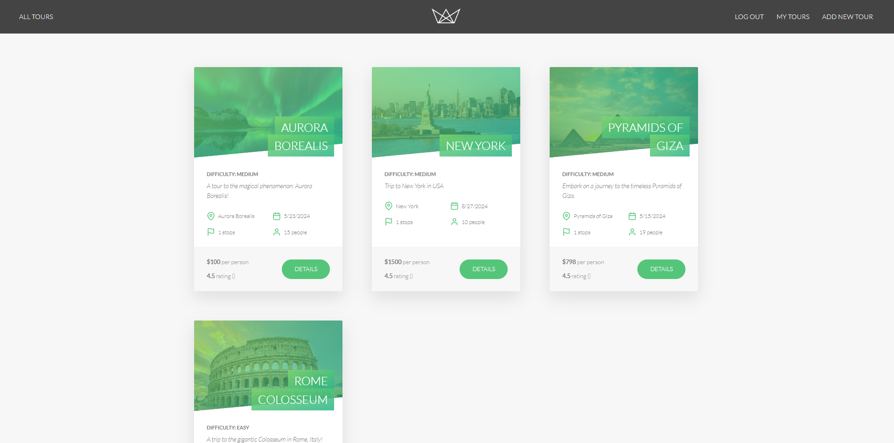
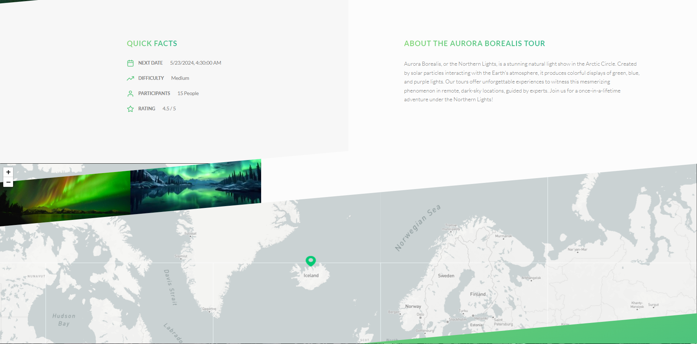
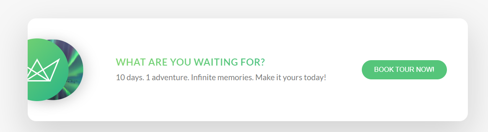
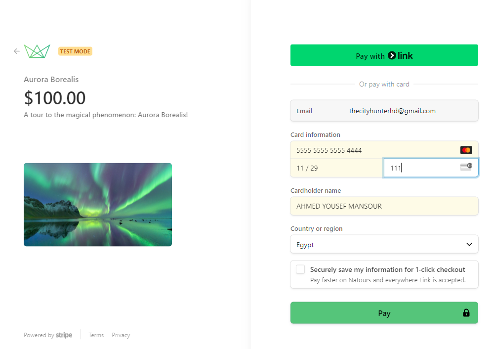
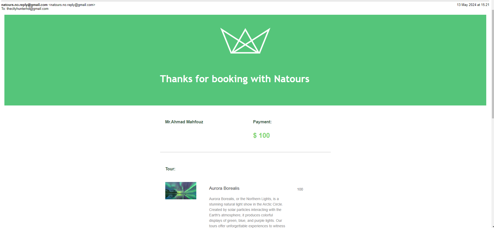
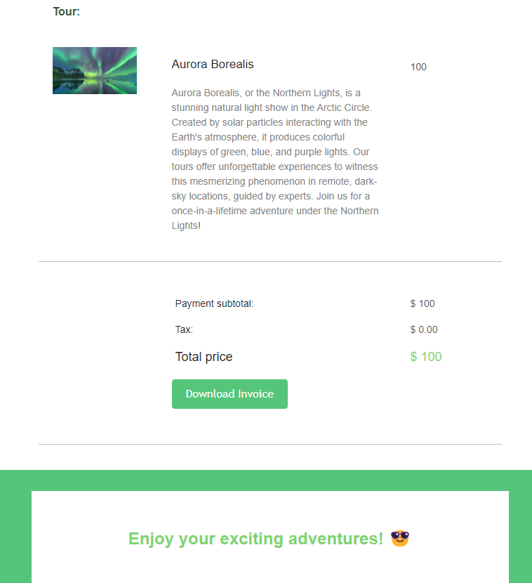
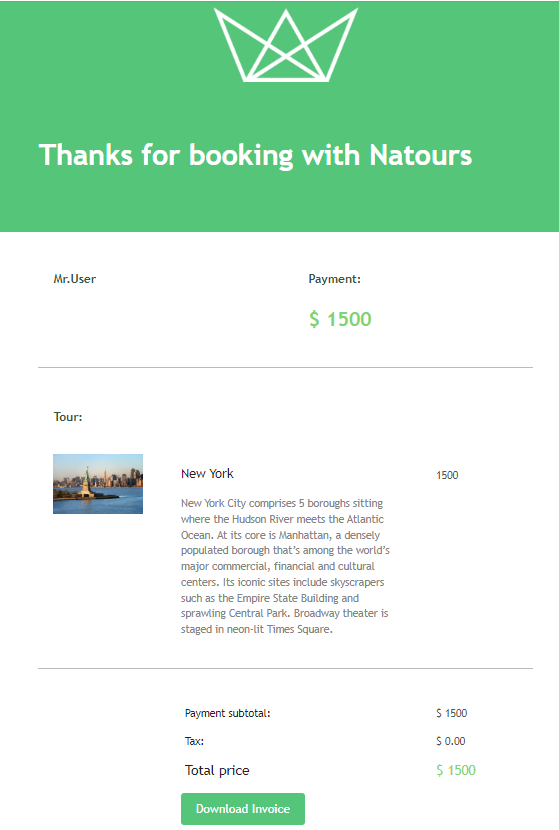
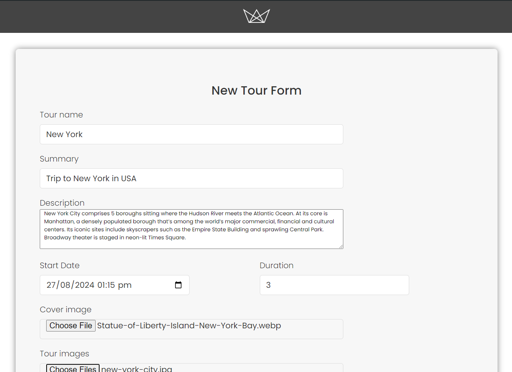
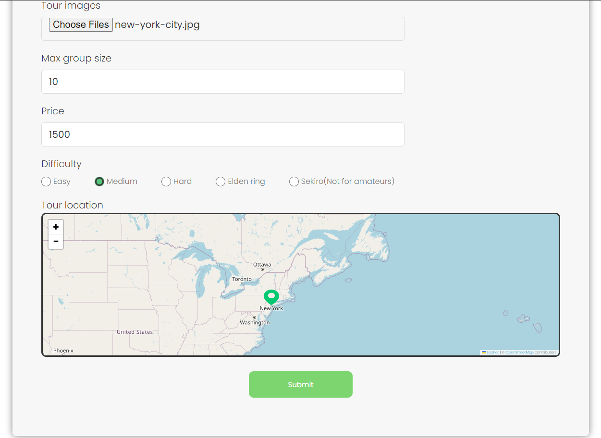
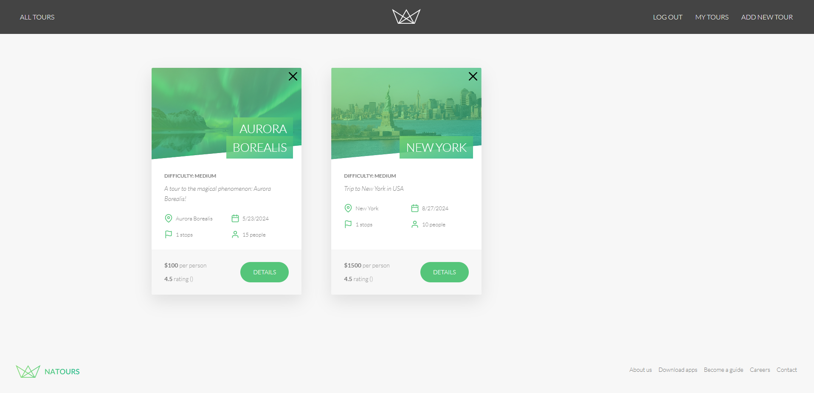

# Traveler Planner Website

Welcome to the Traveler Planner Website! This web application helps users plan their travels efficiently by providing tools to schedule their tours, manage itineraries, and explore destinations.

## Table of Contents

- [Traveler Planner Website](#traveler-planner-website)
  - [Table of Contents](#table-of-contents)
  - [Features](#features)
  - [Natours](#natours)
  - [Installation](#installation)
- [Usage](#usage)
  - [User](#user)
  - [Company](#company)
- [Technologies Used](#technologies-used)
- [Contributing](#contributing)
  - [Team memebers](#team-memebers)

## Features

- **Tour booking**: Books tours with ease using the intuitive interface.
- **Booking Management**: Manage your itinerary by adding, editing, and removing destinations and activities.
- **Destination Explorer**: Explore destinations and discover popular attractions, restaurants, and accommodations.
- **User Authentication**: Register an account and log in securely to access personalized features.
- **Payments**: Tour's payments are handled via Strip.
- **Responsive Design**: Enjoy a seamless experience across devices, including desktops, tablets, and smartphones.
- **Validate Booking**: Booking details are sent via mail.

## [Natours](https://natours-0ulj.onrender.com/login)





## Installation

1. Clone the repository: ToDo

```bash
git clone https://github.com/mohamed-most/software_engineering_project
```
2. Install dependencies:
```bash
npm install
```
3. Set up environment variables:

- Create a .env file based on the .env.example template.
- Update the variables with your environment-specific values.

4. Start the development server:
```bash
npm start
```
6. Open your web browser and navigate to `http://localhost:your-port` to view the application.

# Usage
## User
1. Sign up for a new account or log in if you already have one.


2. Explore tours.


3. Book your Tour.






4. Pay for your tour using your credit card.




5. An email confirming your booking is sent.






## Company
1. Sign up for a new account or log in if you already have one.


2 form. Add a new tour using the map.


3. Plan your Tour by adding destinations and activities to your itinerary.






# Technologies Used
- Frontend: HTML, CSS, JavaScript
- Backend: Node.js, Express.js
- Database: MongoDB (or alternative)
- Authentication: JSON Web Tokens (JWT)
- External APIs: Leaf Map API, Strip API

# Contributing
Contributions are welcome! To contribute to this project, please follow these steps:

1. Fork the repository.
2. Create a new branch (git checkout -b feature/improvement).
3. Make your changes and commit them (git commit -am 'Add new feature').
4. Push to the branch (git push origin feature/improvement).
5. Create a new pull request.


## Team memebers
| # | Name  | ID |
| - |------------- | ------- |
| 1 |[Omar Saleh Mohamed Abdo](https://github.com/MrMariodude)  | 2001993 |
| 2 |[Ahmad Youssef Mansour Mahfouz](https://github.com/rye141200) | 2002238 |
| 3 |[Youssef Wael Hamdy Ibrahim Ashmawy](https://github.com/youssefashmawy)  | 2001430 |
| 4 |[Fathy Abdlhady Fathy](https://github.com/FathyAbdlhady)  | 2001152 |
| 5 |[Yousef Shawky Mohamed](https://github.com/thedarkevil987)  | 2001500 |
| 6 |[Abdallah Mohamed Hassan](https://github.com/AntiHexCodeII)  | 2001803 |
| 7 |[Mazen Waleed Abdelmonem Zein](https://github.com/MazenZein1512)  | 2000978 |
| 8 |[Mohamed Mostafa Mahmoud](https://github.com/mohamed-most)  | 2001299 |
